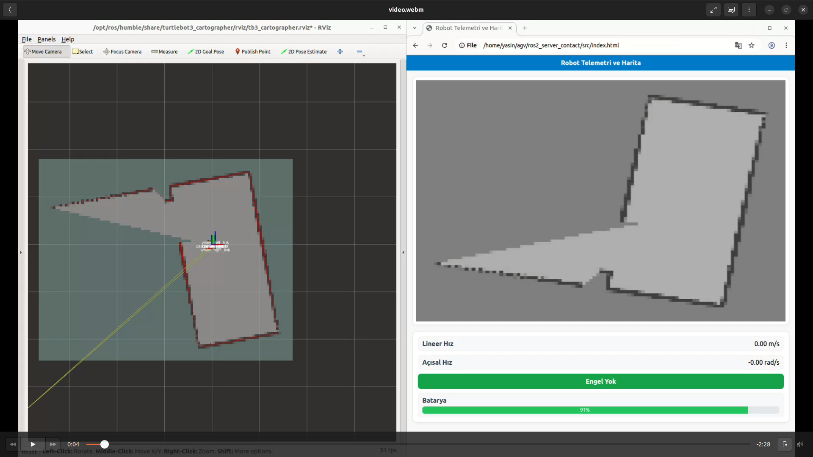

# ros2_server_contact

### Nasıl Çalıştırılır

İndirilmesi gerekenler
'''bash  
sudo apt install ros-humble-navigation2 ros-humble-nav2-bringup ros-humble-turtlebot3*
sudo apt install ros-humble-rmw-cyclonedds-cpp
sudo apt install ros-humble-urdf-tutorial 
sudo apt install ros-humble-desktop
sudo apt install gazebo ros-humble-gazebo-ros-pkgs ros-humble-gazebo-plugins
sudo apt install ros-humble-rosbridge-suite
'''

Bu kısım doldurulacak

- Server ile iletişim için * rosbridge_suite *  kütüphanesi kullanıldı 
- https://github.com/ROBOTIS-GIT/turtlebot3_simulations
- Bu linkte bulunan turtlebot3_gazebo ile gazebo rviz vd SLAM  kullanılarak robot haraketleri ile harita oluşturuldu.
- Harita /map yayınından çekildi -> MapToJpegNode
- /speed_linear hız verisi alındı -> speed_estimator_node.py
- /speed_angular açısal hız verisi alındı -> speed_estimator_node.py
- Batarya şarjbilgisi "battery_passthrough_node.py" dosaysında bulunan node 100 yavaş yavaş azalarak üretildi. (%0.1)
- Engel mesafe algılama "obstacle_detector_node.py" node yapıldı. Çeşitli topiklerden alınarak(Bu ksım genelde chat baktı) - - - server_bridge_node.py dosyası ile server ile bağlantı kurularak bilgiler gönderildi

'''bash
colcon build --symlink-install 
source ~/.bashrc
ros2 launch data_contact_py_pkg telemetry_system.launch.py 
'''

Robot kontrolü için farklı bir terminalden 

'''bash
ros2 run turtlebot3_teleop teleop_keyboard 
'''

serveri başlat farklı bir termnalden

'''bash
ros2 launch rosbridge_server rosbridge_websocket_launch.xml
'''